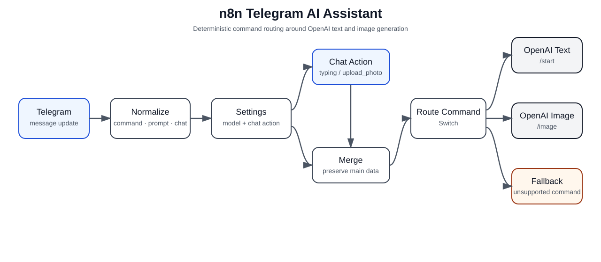

# n8n Telegram AI Assistant

[Русская версия](README.ru.md)

A portfolio-ready n8n workflow for a Telegram bot that routes commands to OpenAI text or image generation, shows chat activity while processing, and returns controlled fallback responses for unsupported commands.

> Focus: workflow orchestration, Telegram Bot API integration, safe n8n Expressions, command routing, text generation, image generation, and real webhook execution evidence.



## What it does

```text
Telegram message
      │
      ▼
Normalize message
      │
      ▼
Runtime settings ──────► Telegram chat action
      │                         │
      └──────────────► Merge ◄──┘
                         │
                         ▼
                    Route command
                    /      |      \
               /start   /image   fallback
                  │        │         │
                  ▼        ▼         ▼
               OpenAI    OpenAI    Help message
                text      image
                  │        │
                  ▼        ▼
              Telegram  Telegram
                text      photo
```

## Supported commands

- `/start` — generates a concise welcome message and explains the available commands.
- `/image <prompt>` — generates a `1024x1024` image and sends it back to the Telegram chat.
- unsupported commands, including `/help` in the tested implementation — return a controlled help/fallback message.

## Engineering highlights

- **Safe message normalization.** Optional chaining and defaults prevent missing Telegram fields from crashing preprocessing.
- **Command extraction with Expressions.** The command and image prompt are derived deterministically before any AI call.
- **Visible processing state.** The bot sends `typing` or `upload_photo` depending on the selected operation.
- **Explicit routing.** An n8n `Switch` separates text generation, image generation, and fallback behavior.
- **Text and image generation.** OpenAI is used for both the `/start` response and `/image` output.
- **Binary image handling.** Generated image data is passed directly to the Telegram send-photo node.
- **Controlled fallback.** Unsupported commands do not call OpenAI unnecessarily.

## Tested behavior

The original implementation was tested through real Telegram webhook executions.

| Command | Verified behavior |
|---|---|
| `/start` | Successful execution; generated OpenAI text sent to Telegram |
| `/image футуристический офис с ИИ-ассистентом` | Successful execution; generated PNG `1024x1024` sent to Telegram |
| `/help` | Successful fallback execution; help message sent to Telegram |

During testing, two runtime issues were found and corrected: an unsupported OpenAI text verbosity setting was changed to a supported value, and the Telegram text expression was corrected so the bot sends the extracted model text instead of a JSON object.

See [Testing](docs/testing.md) and [Evidence](docs/evidence.md).

## Stack

`n8n` · `Telegram Bot API` · `OpenAI` · `GPT image generation` · `Expressions` · `Switch` · `Merge`

## Repository structure

```text
.
├── workflow/
│   └── telegram-ai-assistant.json
├── examples/
│   └── commands.md
├── docs/
│   ├── architecture.md
│   ├── setup.md
│   ├── testing.md
│   ├── evidence.md
│   └── images/
│       └── architecture.svg
├── .gitignore
├── LICENSE
├── README.md
└── README.ru.md
```

## Quick start

1. Import [`workflow/telegram-ai-assistant.json`](workflow/telegram-ai-assistant.json) into n8n.
2. Connect your own Telegram and OpenAI credentials.
3. Review the configured OpenAI text and image models and select equivalents available in your environment if necessary.
4. Start the workflow in test/listening mode or activate it so Telegram can reach the webhook.
5. Send the commands from [`examples/commands.md`](examples/commands.md).
6. Confirm text, image, and fallback branches before using the workflow beyond a test bot.

Detailed instructions: [Setup](docs/setup.md).

## Key Expressions

Safe input text:

```text
{{ $json?.message?.text ?? "" }}
```

Command extraction:

```text
{{ ($json?.message?.text ?? "").trim().split(/\s+/)[0]?.toLowerCase() || "" }}
```

Image prompt extraction:

```text
{{ ($json?.message?.text ?? "").replace(/^\/image\s*/i, "").trim() }}
```

Telegram activity selection:

```text
{{ $json.message.command === "/image" ? "upload_photo" : "typing" }}
```

## Security and portability

The public workflow export is sanitized. It does not include the original workflow/version identifiers, webhook UUIDs, Telegram bot token, OpenAI API key, or credential references.

After import, credentials must be connected manually in n8n. Use a dedicated test bot while validating the workflow, and avoid publishing screenshots that expose bot tokens, private chat data, credential names, or production identifiers.

## Known limitations

- The workflow is command-oriented rather than a general conversational agent.
- `/image` falls back to a default image prompt when no description is supplied; production UX may instead validate and reject an empty prompt.
- The current fallback handles all unsupported commands uniformly.
- A production implementation should add centralized error handling, observability, rate limits, abuse controls, and potentially per-user quotas for image generation.

## License

MIT — see [`LICENSE`](LICENSE).
